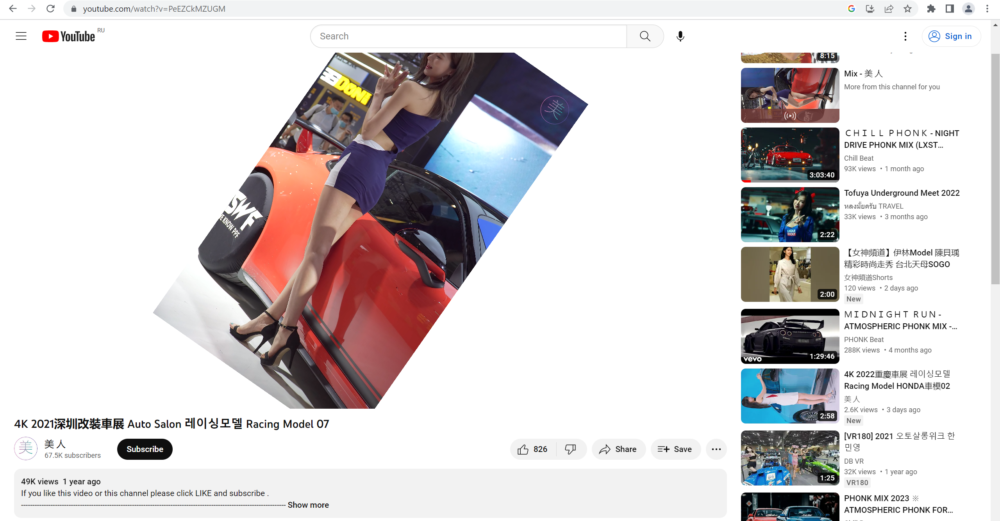

# ROTATE YOUTUBE VIDEO: Rotate and scale YouTube video

This extension lets you to rotate and scale YouTube videos.

## Installation

Download ZIP and install it in a browser by an extensions manager.
Reload the Youtube page if already active to see it in action.

## Debugging / Local Installation

### Firefox

For some reason, this extension does not work in Firefox when using Manifest v3, for that reason, we have a separate Manifest v2 for Firefox

- Clone or download this repository
- Copy everything from `manifest_ff.json` into `manifest.json`
- Go to `about:debugging` (type in the address bar)
- Click *This Firefox* > *Load Temporary Add-On*
- Browse to the extension folder and select `manifest.json`
- Click *Reload* after making any code changes
- Reload the Youtube page if already active to see it in action

### Chrome

- Clone or download this repository
- Go to `chrome://extensions` (type in the address bar)
- Click "Load Unpacked" and select the extension folder
- Reload the Youtube page if already active to see it in action

## Functionality

Press CTRL and move mouse over a video horizontally to rotate the video.
Press CTRL and move mouse over the video vertically to scale the video.

The extension is supported by Chrome and Firefox.
Safari support is untested.

## Security & Privacy

This extension only has access to `https://www.youtube.com/*` and only accesses the page DOM.

It does not access your YouTube cookies or other personal data in any way.

## Community

Feel free to open issues or submit PRs.
